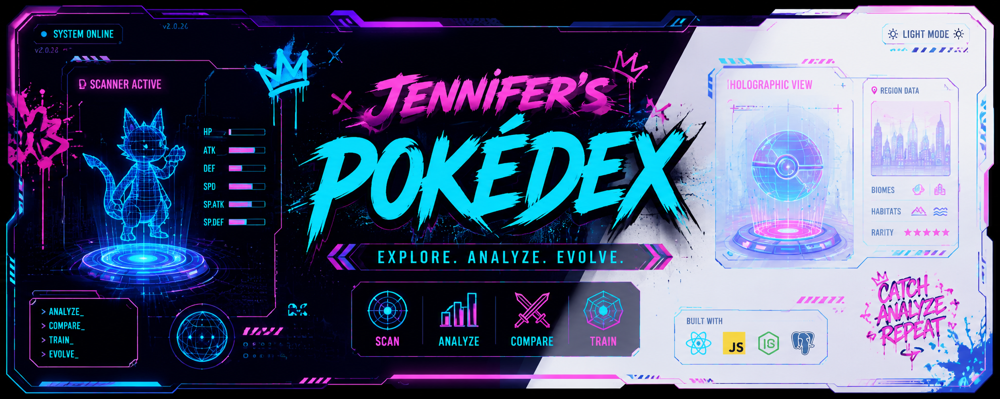

# ⚡ Jennifer’s Pokédex

A fullstack Pokémon analyzer platform inspired by cyberpunk aesthetics, NYC subway graffiti culture, and futuristic Pokédex interfaces.

Built with React, PostgreSQL, Express, PokéAPI, and immersive neon UI design, this project evolved from a simple Pokédex into an interactive Pokémon exploration platform featuring battle analysis, comparison systems, favorites persistence, responsive dual-panel layouts, and animated scanning interfaces.

---

# 🌐 Live Demo

🔗 https://react-pokedex-app-sooty.vercel.app/

---

# 📸 Screenshots

## 🖥️ Cyberpunk Pokédex Interface


---

## 📱 Mobile Responsive Layout


---

# ✨ Features

## 🧠 Pokémon Analyzer System
- Interactive Pokédex scanning interface
- Animated Pokémon scan display
- Dynamic Pokémon detail analysis
- Training profile analysis
- Threat level analysis
- Battle style classification
- Evolution chain navigation
- Pokémon lore and habitat exploration

---

## ⚔️ Compare & Battle System
- Side-by-side Pokémon comparison
- Animated VS interface
- Battle prediction engine
- Type effectiveness analysis
- Stat comparison highlighting
- Searchable compare selectors
- Type-themed compare cards

---

## ❤️ Favorites System
- Add/remove favorites
- PostgreSQL-backed favorites persistence
- Favorites page with live updates
- Backend API integration
- Fullstack favorites architecture

---

## 🎨 UI / UX Features
- Cyberpunk neon Pokédex redesign
- NYC graffiti-inspired color styling
- Responsive open Pokédex layout
- Animated scan effects
- Floating holographic Pokémon displays
- Hardware-inspired control deck
- Interactive hover animations
- Light/Dark mode support
- Accessibility improvements
- Keyboard navigation support
- Responsive mobile and tablet experience

---

# 🛠️ Tech Stack

## Frontend
- React
- React Router
- JavaScript
- CSS
- Vite

## Backend
- Node.js
- Express
- PostgreSQL

## APIs & Deployment
- PokéAPI
- Vercel
- Render

---

# 🧱 Architecture Overview

The project uses a modular frontend architecture focused on reusable hooks, utility functions, and scalable component organization.

## Key Architectural Patterns
- Reusable custom hooks
- Utility-driven analyzer logic
- Component-based UI system
- Dedicated style architecture
- Responsive layout separation
- Backend API integration
- PostgreSQL persistence layer

---

# 🚀 Local Installation

## Clone Repository

```bash
git clone <your-repository-url>
```

---

## Install Frontend Dependencies

```bash
cd client
npm install
npm run dev
```

---

## Install Backend Dependencies

```bash
cd server
npm install
npm run dev
```

---

# 🔐 Planned Future Features

## Authentication & Security
- User accounts
- Secure login system
- Password hashing with bcrypt
- JWT authentication
- Protected API routes
- User-owned favorites
- Secure environment variable management

---

## Pokémon Platform Expansion
- Pokémon team builder
- Saved battle history
- Personal trainer dashboard
- Pokémon notes/journal system
- Radar stat visualization
- Sound effects and battle audio
- Expanded Pokémon generations

---

# 🧠 What I Learned

This project helped strengthen my understanding of:

- Fullstack architecture
- PostgreSQL integration
- RESTful API development
- React hooks and reusable logic
- Component architecture
- Responsive UI/UX design
- Accessibility best practices
- State management patterns
- Animation and interaction design
- API data transformation
- The importance of scalable CSS organization

It also pushed me creatively. Styling and UI/UX design have traditionally been weaker areas for me, so this project became an opportunity to learn how to leverage AI-assisted workflows to improve frontend creativity, interaction design, and user experience thinking.

---

# 🎨 Design Inspiration

The cyberpunk redesign was inspired by:
- futuristic Pokédex interfaces
- neon cyberpunk aesthetics
- NYC subway graffiti culture
- holographic scanner systems

One of my favorite parts of the project is the animated scanning interface and the interactive Pokémon cards that visually “lift” off the screen when selected.

---

# ⚔️ Biggest Challenge

The Pokémon compare system was the most challenging part of the build because it required balancing:
- technical architecture
- reusable logic
- UI creativity
- animation coordination
- responsive design

Building the compare experience pushed me to think more deeply about frontend engineering and interaction design.

---

# 👩🏽‍💻 Developer

Built by Jennifer Peterson

Focused on:
- Fullstack Development
- Cybersecurity
- Backend Engineering
- Interactive UI Systems

---

© 2026 Jennifer Peterson • Built with React, PostgreSQL, PokéAPI, and futuristic Pokédex vibes ⚡